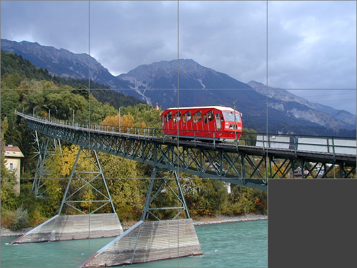
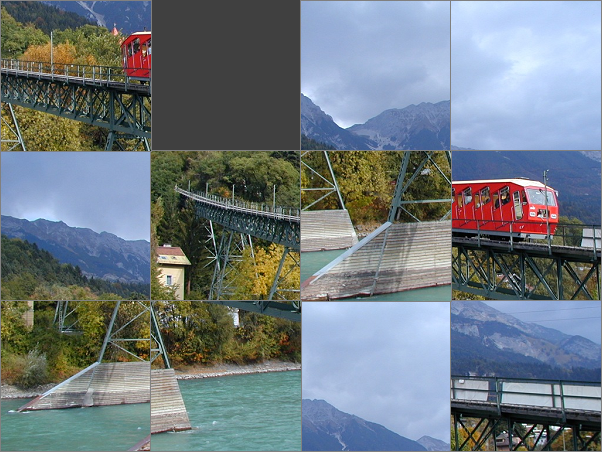
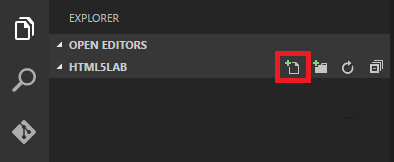

<a name="HOLTitle"></a>
# Using the HTML5 Canvas API to Build Rich Web Apps #

---

<a name="Overview"></a>
## Overview ##

HTML5 is the newest version of HTML, and is the basis for numerous rich and interactive Web pages as well as cross-platform mobile apps. More than just a markup language, HTML5 exposes a set of APIs that can be called from within a browser to draw onto a Web page, store data locally, get the user's current location, establish 2-way connections between browsers and Web servers, read the contents of files, play audio and video, and much more. HTML5 is constantly evolving with new features and APIs, and browser vendors such as Google and Microsoft are constantly updating their browsers to support the latest and greatest features of the platform.

One of the most compelling features of HTML5 is the [Canvas API](http://www.w3.org/TR/2dcontext/), which allows JavaScript code to draw directly into a browser window. To use the Canvas API, you begin by declaring one or more \<canvas\> elements in a page. Then you write code that retrieves a rendering context for a canvas, and call functions on the rendering context to draw pixels, lines, shapes, images, text, drop shadows, gradients, and more. The chart below was drawn entirely with the Canvas API, and uses just a few of the many functions that are available.


_Chart drawn with the HTML5 Canvas API_

In this lab, you will create a Web page that combines the HTML5 Canvas API with jQuery to display an interactive puzzle — one in which an image is programmatically divided into squares and the user is invited to scramble the image (and later unscramble it) by clicking individual squares. It is just one example of the kinds of interfaces you can build with the Canvas API. And it's a great place to start if you are new to HTML5 and are curious about why it is receiving so much attention in the development community. 

<a name="Objectives"></a>
### Objectives ###

In this hands-on lab, you will learn how to:

- Create and configure an HTML5 project in Visual Studio Code
- Use the HTML5 Canvas API to subdivide an image into pieces
- Draw an image (or part of an image) onto an HTML5 canvas
- Manipulate HTML5 canvases with jQuery

<a name="Prerequisites"></a>
### Prerequisites ###

The following are required to complete this hands-on lab:

- [Visual Studio Code](http://code.visualstudio.com)
- An HTML5 browser such as Edge, Chrome, Safari, or Firefox

---

<a name="Exercises"></a>
## Exercises ##

This hands-on lab includes the following exercises:

- [Exercise 1: Learning The Canvas API](#Exercise1)
- [Exercise 2: Use the Canvas API to cut the image into squares](#Exercise2)
- [Exercise 3: Use jQuery to make the puzzle interactive](#Exercise3)
- [Appendix 1: Create an HTML5 project in Visual Studio Code](#Appendix1) 

<a name="Exercise1"></a>
## Exercise 1: Learning The Canvas API ##

If you would like to use Visual Studio Code for this lab, follow instructions in Appendix 1. You can use any code editor you have installed.

1. Open the directory **beginning**, it will contain a styles directory, an assets directory and an index.html file. .

1. The following markup is in **index.html**:

	```html
	<!DOCTYPE html>
	<html>
	<head>
	    <meta charset="utf-8" />
	    <meta http-equiv="X-UA-Compatible" content="IE=Edge" /> 
	    <link rel="stylesheet" type="text/css" href="assets/styles.css">
	</head>
	
	<body>
	    <div id="main">
	        
	    </div>
	</body>
	</html>
	````

	> The DOCTYPE element in the first line identifies this page as an HTML5 page. Some browsers will not honor HTML5 conventions in a page unless that page begins with this statement.

1. The following statements are in **styles.css**:

	```css
    body {
        background-color: #404040;
    }
    #main { 
	    position: absolute;
        width: 600px;
        height: 450px;
        top: 50%;
        left: 50%;
        margin-left: -300px;
        margin-top: -225px;
    }
	````

	> The CSS statements gives our #main div an absolute size so that we can correctly position our elements when we start working on the puzzle exercise.

1. To draw using the Canvas API is that we need to get a context for the context element. Calling getContext on a <canvas> element returns a reference to an instance of the CanvasRenderingContext2d. The CanvasRenderingContext2d:

* Provides methods for drawing primitives
* Provides properties affecting what's drawn, including: strokeStyle and fillStyle lineWidth, lineCap, lineJoin, and miterLimit shadowOffsetX, shadowOffsetY, shadowBlur, and shadowColor, font, textAlign, textBaseline
* Provides save and restore methods for saving and restoring canvas state (property values, transformation matrix, etc.)
* Also includes globalAlpha and globalCompositeOperation properties ("global" properties)

1. Let's add a scratch canvas to our index.html page after the `<body>` element.

	```html
	<canvas id="scratch" width="500" height="500"></canvas>
	```

1. Now let's add a `<script>` element to our `<head>` element so that we can easily execute some JavaScript.

1. To get the Canvas Rendering Context, use the following code:

	```js
	var canvas = document.getElementById("scratch");
	var dc = canvas.getContext("2d");
	```

1. To draw rectangle, we can add the strokeRect function to our script element. The first and second parameters are the x, y coordinates on the canvas where we want the top-left point of the rectangle to start. The third and last paremeters are the width and height of the rectangle.

	```js
	dc.strokeRect(100, 50, 200, 100);
	```	

1. To change the stroke color, we can set the stroke style before calling the strokeRect() function. 

	```js
	dc.strokeStyle = "red";
	```

1. To change the stroke width, we can set the line width style before calling the strokeRect() function.

	```js
	dc.lineWidth = 8;
	```

1. To fill the rectangle with a color, we can call the fillRect() function instead of strokeRect().

	```js
	dc.fillRect(100, 50, 200, 100);
	```

1. To change the color of the fill, we can set the fillStyle property before calling the fillRect() function.

	```js
	dc.fillStyle = "red";
	```

1. To draw with a color gradient we will need to create a Linear Gradient object, add color stops and then assign it to the fillStyle. The four parameters passed to createLinearGradient are the coordinates x0, y0, x1, and y1, specifying the line along which the gradient is drawn. It's weird to have to set the gradient coordinates along with the rectangle coordinates. You can also fill rectangles (and other shapes) with radial gradients and with "patterns" -- images, videos, and other canvases.

	```js
	var gradient = dc.createLinearGradient(100, 50, 300, 50);
	gradient.addColorStop(0, "red");
	gradient.addColorStop(1, "yellow");
	dc.fillStyle = gradient;
	```

1. To draw text, we can use the strokeText function. The strokeText method draws unfilled text. Properties such as font and strokeStyle control the visual attributes of the text that you draw.

	```js
	dc.font = "bold 72pt sans-serif";
	dc.strokeStyle = "red";
	dc.strokeText("HTML5", 40, 130);
	```

1. The fillText method draws filled text. Although not shown here, you can draw gradient text by assigning a gradient to fillStyle.

	```js
	dc.font = "bold 72pt sans-serif";
	dc.fillStyle = "red";
	dc.fillText("HTML5", 40, 130);
	```

1. You can draw drop shadows behind anything you draw with the Canvas API. The shadowOffsetX, shadowOffsetY, shadowBlur, and shadowColor properties of CanvasRenderingContext2d control the depth, color, and blurriness of the shadow. Note that alpha value of 0.5, which allows objects behind the drop shadow to partially show through. The ability to include alpha values in colors is new in HTML5. Note that "rgba(…)" is a string. It doesn't work if you omit the quotation marks.

	```js
	dc.shadowOffsetX = 4;
	dc.shadowOffsetY = 4;
	dc.shadowBlur = 8;
	dc.shadowColor = "rgba(0, 0, 0, 0.5)";
	dc.font = "bold 72pt sans-serif";
	dc.fillStyle = "red";
	dc.fillText("HTML5", 40, 130);
	```

1. You can draw an image using the drawImage function but you'll need to add it to the html. You can only draw images on window load after the image is ready, so we'll add a function for window.onload. Replace the contents of the script element with the below sample.

	```html
	
	```

	```js
	// JavaScript
	window.onload = function () {
		var canvas = document.getElementById("scratch");
		var dc = canvas.getContext("2d");
		var image = document.getElementById("flowers");
		dc.drawImage(image, 0, 0);
	}
	```

1. You will notice that the image is a smaller than the canvas, you can scale the image by adding arguments to the drawImage function. 

	```js
    dc.drawImage(image, 0, 0, canvas.width, canvas.height);
	```

1. Rather than declare the image that you draw in the HTML, you can programmatically load the image. It is important not to draw the image until the browser fires an onload event indicating that the image has been loaded.

	```js
	// JavaScript
	var image = new Image();
	image.src = "assets/flowers.png";
	image.onload = function () {
		dc.drawImage(image, 0, 0);
	}
	```

1. This example generates a 100 x 100 image containing random colors and renders it to a canvas. It begins by calling createImageData to create an imageData object, whose data properties exposes the ARGB components of each pixel in the image. Then it assigns random values to the R, G, and G components of each pixel. One use for this technique is writing apps that draw fractal images.

	```js
	var bitmap = dc.createImageData(100, 100);

	for (x = 0; x < bitmap.width; x++)
		for (y = 0; y < bitmap.height; y++)
			drawRandomColor(bitmap, x, y);

	dc.putImageData(bitmap, 0, 0);

	function drawRandomColor(bitmap, x, y) {
		var index = (x + y * bitmap.width) << 2;
		bitmap.data[index + 0] = Math.random() * 256; // Red
		bitmap.data[index + 1] = Math.random() * 256; // Green
		bitmap.data[index + 2] = Math.random() * 256; // Blue
		bitmap.data[index + 3] = 255; // Alpha
	}
	```

1. Sometimes we want to manipulate the image to create interesting filters. With this technique, it is possible to build photo-editing apps using HTML5. This is how you would implement a toGray() function:

	```js
	function toGray(bitmap, x, y) {
		var index = (x + y * bitmap.width) << 2;
		var r = bitmap.data[index + 0];
		var g = bitmap.data[index + 1];
		var b = bitmap.data[index + 2];
		var gray = (0.3 * r) + (0.59 * g) + (0.11 * b);
		bitmap.data[index + 0] = gray;
		bitmap.data[index + 1] = gray;
		bitmap.data[index + 2] = gray;
	}

	var image = new Image();
	image.src = "assets/flowers.png";
	image.onload = function () {
		dc.drawImage(image, 0, 0, canvas.width, canvas.height);
		bitmap = dc.getImageData(0, 0, canvas.width, canvas.height);
		for (x = 0; x < bitmap.width; x++)
			for (y = 0; y < bitmap.height; y++)
				toGray(bitmap, x, y); // Helper function

		dc.putImageData(bitmap, 0, 0);
	}
	```

<a name="Exercise2"></a>
## Exercise 2: Use the Canvas API to cut the image into squares ##

The Canvas API is one of HTML5's most powerful APIs. With it, you can draw onto \<canvas\> elements declared in a page. You can even take an existing image such as **scene.png** and "cut" it into squares, drawing each square onto a separate canvas. In this exercise, you will add JavaScript code to **index.html** to divide **scene.png** into squares (canvases) aligned in a 4x3 array to show the original image.

1. Open **index.html** in Visual Studio Code and replace its contents with the following markup:

    ```html
	<!DOCTYPE html>
	<html>
	<head>
	    <meta charset="utf-8" />
	    <meta http-equiv="X-UA-Compatible" content="IE=Edge" /> 
	    <link rel="stylesheet" type="text/css" href="assets/styles.css">
	    <script type="text/javascript" src="https://code.jquery.com/jquery-2.2.4.min.js"></script>
	</head>
	
	<body>
	    <div id="main">
	        <canvas id="c00" width="150" height="150" style="position: absolute; left: 0px; top: 0px; border: 1px solid gray"></canvas>
	        <canvas id="c01" width="150" height="150" style="position: absolute; left: 150px; top: 0px; border: 1px solid gray"></canvas>
	        <canvas id="c02" width="150" height="150" style="position: absolute; left: 300px; top: 0px; border: 1px solid gray"></canvas>
	        <canvas id="c03" width="150" height="150" style="position: absolute; left: 450px; top: 0px; border: 1px solid gray"></canvas>
	        <canvas id="c10" width="150" height="150" style="position: absolute; left: 0px; top: 150px; border: 1px solid gray"></canvas>
	        <canvas id="c11" width="150" height="150" style="position: absolute; left: 150px; top: 150px; border: 1px solid gray"></canvas>
	        <canvas id="c12" width="150" height="150" style="position: absolute; left: 300px; top: 150px; border: 1px solid gray"></canvas>
	        <canvas id="c13" width="150" height="150" style="position: absolute; left: 450px; top: 150px; border: 1px solid gray"></canvas>
	        <canvas id="c20" width="150" height="150" style="position: absolute; left: 0px; top: 300px; border: 1px solid gray"></canvas>
	        <canvas id="c21" width="150" height="150" style="position: absolute; left: 150px; top: 300px; border: 1px solid gray"></canvas>
	        <canvas id="c22" width="150" height="150" style="position: absolute; left: 300px; top: 300px; border: 1px solid gray"></canvas>
	    </div>
	</body>
	</html>
    ```

1. Take a moment to examine the markup that you added. The \ element that displays **scene.png** has been replaced with 11 \<canvas\> elements, each measuring 150 by 150 pixels. CSS positioning is used to arrange the \<canvas\> elements into rows and columns. 

1. We will also add a \<script\> element that loads jQuery from the jQuery CDN, as well as a \<script\> element containing code that programmatically loads **scene.png** and uses the Canvas API to draw portions of the image onto the individual canvases. Specifically, we will create two loops to clip the image and draw in the appropriate row/column canvas.

* **img:** Specifies the image, canvas, or video element to use	 
* **sx:** *Optional* The x coordinate where to start clipping
* **sy:** *Optional* The y coordinate where to start clipping
* **swidth:** *Optional* The width of the clipped image
* **sheight:** *Optional* The height of the clipped image
* **x:** The x coordinate where to place the image on the canvas
* **y:** The y coordinate where to place the image on the canvas
* **width:** *Optional* The width of the image to use (stretch or reduce the image)
* **height:** *Optional* The height of the image to use (stretch or reduce the image)

	```js
	<script type="text/javascript">
		var _row = 2; // Row containing empty square
		var _col = 3; // Column containing empty square

		$(function () {
			if (!document.createElement("canvas").getContext) {
				alert("This browser doesn't support the HTML5 Canvas API");
				return;
			}

			// Load the puzzle image
			var image = new Image();
			image.src = "assets/scene.png";

			image.onload = function () {
				// Draw sections of the image into the puzzle pieces
				for (var row = 0; row < 3; row++) {
					for (var col = 0; col < 4; col++) {
						if (!(row == 2 && col == 3)) {
							var context = document.getElementById("c" + row + col).getContext("2d");
							context.drawImage(image, col * 150, row * 150, 150, 150, 0, 0, 150, 150);
						}
					}
				}
			};
		});
	</script>
	```

1. Save your changes to **index.html** if you haven't already. Then press **Ctrl+Shift+B** (on a Mac, **Command+Shift+B**) to view **index.html** in your browser.

1. Confirm that the page now resembles the one below, with the original image divided into squares and one square missing from the bottom right:

    

    _The modified page_

1. Close your browser and return to Visual Studio Code.

<a name="Exercise3"></a>
## Exercise 3: Use jQuery to make the puzzle interactive ##

**index.html** now resembles one of those children's puzzles in which you slide squares around to scramble an image, and then attempt to solve the puzzle by restoring the squares to their original positions. In this exercise, you will use jQuery to make the puzzle interactive, so that when a piece adjacent to the empty square is clicked, it slides into the empty square.

1. Open **index.html** in Visual Studio Code and replace its contents with the following markup:

    ```html
	<!DOCTYPE html>
	<html>
	<head>
	    <meta charset="utf-8" />
	    <meta http-equiv="X-UA-Compatible" content="IE=Edge" /> 
	    <link rel="stylesheet" type="text/css" href="assets/styles.css">
	    <script type="text/javascript" src="https://code.jquery.com/jquery-2.2.4.min.js"></script>
	
	    <script type="text/javascript">
	        var _row = 2; // Row containing empty square
	        var _col = 3; // Column containing empty square
	
	        $(function () {
	            if (!document.createElement("canvas").getContext) {
	                alert("This browser doesn't support the HTML5 Canvas API");
	                return;
	            }
	
	            // Load the puzzle image
	            var image = new Image();
	            image.src = "assets/scene.png";
	
	            image.onload = function () {
	                // Draw sections of the image into the puzzle pieces
	                for (var row = 0; row < 3; row++) {
	                    for (var col = 0; col < 4; col++) {
	                        if (!(row == 2 && col == 3)) {
	                            var context = document.getElementById("c" + row + col).getContext("2d");
	                            context.drawImage(image, col * 150, row * 150, 150, 150, 0, 0, 150, 150);
	                        }
	                    }
	                }
	            };
	
	            $("canvas").click(function (e) {
	                var piece = $(this);
	
	                // Get the row and column
	                var row = piece.position().top / 150;
	                var col = piece.position().left / 150;
	
	                if (row == _row && col == _col + 1) {
	                    // Move left
	                    piece.animate({ left: "-=150px" }, "fast");
	                    _col++;
	                }
	                else if (row == _row && col == _col - 1) {
	                    // Move right
	                    piece.animate({ left: "+=150px" }, "fast");
	                    _col--;
	                }
	                else if (col == _col && row == _row + 1) {
	                    // Move up
	                    piece.animate({ top: "-=150px" }, "fast");
	                    _row++;
	                }
	                else if (col == _col && row == _row - 1) {
	                    // Move down
	                    piece.animate({ top: "+=150px" }, "fast");
	                    _row--;
	                }
	            });
	        });
	    </script>
	</head>
	
	<body>
	    <div id="main">
	        <canvas id="c00" width="150" height="150" style="position: absolute; left: 0px; top: 0px; border: 1px solid gray"></canvas>
	        <canvas id="c01" width="150" height="150" style="position: absolute; left: 150px; top: 0px; border: 1px solid gray"></canvas>
	        <canvas id="c02" width="150" height="150" style="position: absolute; left: 300px; top: 0px; border: 1px solid gray"></canvas>
	        <canvas id="c03" width="150" height="150" style="position: absolute; left: 450px; top: 0px; border: 1px solid gray"></canvas>
	        <canvas id="c10" width="150" height="150" style="position: absolute; left: 0px; top: 150px; border: 1px solid gray"></canvas>
	        <canvas id="c11" width="150" height="150" style="position: absolute; left: 150px; top: 150px; border: 1px solid gray"></canvas>
	        <canvas id="c12" width="150" height="150" style="position: absolute; left: 300px; top: 150px; border: 1px solid gray"></canvas>
	        <canvas id="c13" width="150" height="150" style="position: absolute; left: 450px; top: 150px; border: 1px solid gray"></canvas>
	        <canvas id="c20" width="150" height="150" style="position: absolute; left: 0px; top: 300px; border: 1px solid gray"></canvas>
	        <canvas id="c21" width="150" height="150" style="position: absolute; left: 150px; top: 300px; border: 1px solid gray"></canvas>
	        <canvas id="c22" width="150" height="150" style="position: absolute; left: 300px; top: 300px; border: 1px solid gray"></canvas>
	    </div>
	</body>
	</html>
	```

1. Take a moment to examine what you added. The only difference is a new block of code that uses jQuery to find all the \<canvas\> elements in the page and attach a click handler to them. The click handler figures out which \<canvas\> element was clicked, determines whether it is adjacent to the empty square, and, if it is, uses jQuery's *animate* function to slide the canvas into a new position.

	> If you have never used jQuery's *animate* function, this is a great example of how easily it enables you to add animations to Web pages, and is one of many reasons jQuery is one of the most popular JavaScript libraries on the planet.

1. Save your changes to **index.html** if you haven't already. Then press **Ctrl+Shift+B** (on a Mac, **Command+Shift+B**) to view **index.html** in your browser.

1. Click one of the puzzle pieces next to the empty square. Then repeat this process until the puzzle is thoroughly scrambled, as shown below.

    

    _index.html with the pieces scrambled_

Can you solve the puzzle by restoring the pieces to their original positions? Give it a try, and if you are unable to, refresh the page in the browser to restore the puzzle to its original state.

<a name="Modernizing This Canvas"></a>
## Modernizing This Canvas ##

To take a more modern approach to building our puzzle, we might want to consider not using the DOM as our data storage technique and having multiple canvas elements. Instead it might be more interesting to use one canvas element and store an abstract representation of our puzzle in JavaScript. You will also have to effectively create a render function yourself to refresh the canvas after every mouse click. At this point, it would be interesting to consider a canvas animation library like [EaselJS](http://www.createjs.com/easeljs).

<a name="Extension Ideas"></a>
## Extensions Ideas ##

**Easy**: Instead of splitting the image into three rows and four columns, write code that randomly chooses how much to split the image. The more rows and columns the harder the puzzle becomes to solve.

**Medium**: Add the ability to load any image from a URL (or a random image from imgur) and generate a puzzle with that image. Having never seen the image before most uses will find it very difficult to solve the puzzle.

**Stretch**: Don't split the puzzle into squares but instead cut the image with special curves using the [Bezier Curves](https://www.sitepoint.com/html5-canvas-draw-bezier-curves/) function. You will also have to make sure that pieces side by side are cut correctly and the image as a whole still fits together. 

<a name="Summary"></a>
## Summary ##

The Web page you built in this lab is just one example of the rich user interfaces you can build with the HTML5 Canvas API. Other uses for the Canvas API include drawing charts and graphs and building sophisticated animations. In this example, you used the Canvas API's *drawImage* function to "cut" an image into squares by drawing different parts of the image onto individual canvases. Then you used jQuery to make the page interactive by animating the movement of canvases. *drawImage* is one of dozens of functions comprising the Canvas API. For more information on *drawImage* and other members of the Canvas API, see http://www.w3.org/TR/2dcontext/ for the official specification.

<a name="Appendix1"></a>
## Appendix 1: Create an HTML5 project in Visual Studio Code ##

You can use Visual Studio Code — Microsoft's free and cross-platform code editor — to build a Web site containing an HTML5 page. If you haven't already installed Visual Studio Code, please download it from http://code.visualstudio.com. You can use another code editor if you  would prefer, but the instructions in this appendix assume you are using Visual Studio Code.

1. Create a directory named "HTML5Lab" in the location on your choice to serve as the project directory.

1. Start Visual Studio Code and use the **File -> Open Folder** command (on a Mac, **File -> Open**) to open the folder you created in the previous step.

1. To create a new file, you can click the **New File** button in the EXPLORER panel and create a new file named **index.html** in the project directory.

    

    _Adding a file to the project directory_

1. To create a new folder, you can click the **New Folder** button in the EXPLORER panel and create a new folder named "assets" in the project directory.

    

    _Adding a folder to the project directory_

1. Press **Ctrl+Shift+B** (on a Mac, **Command+Shift+B**) and click **Configure Task Runner**.

    

    _Configuring a task runner_

1. Select **Others** from the ensuing menu.

    

    _Selecting a task runner_

1. If you are running Windows, replace the contents of the **tasks.json** file that is created with the following statements:

	```json
	{
	    "version": "0.1.0",
	    "command": "launch",
	    "windows": {
	        "command": "explorer"
	    },
	    "args": ["index.html"]
	}
	```

	If you are using a Mac instead, replace the contents of **tasks.json** with these statements:

	```json
	{
	    "version": "0.1.0",
	    "command": "launch",
	    "osx": {
	        "command": "open"
	    },
	    "args": ["index.html"]
	}
	```

	If you are running Linux, replace the contents of **tasks.json** with these statements:

	```json
	{
	    "version": "0.1.0",
	    "command": "launch",
	    "linux": {
	        "command": "xdg-open"
	    },
	    "args": ["index.html"]
	}
	```

	Once these changes are made, save your changes to **tasks.json**.

	> The purpose adding these statements to **tasks.json** is to allow you to launch index.html in a browser directly from Visual Studio Code. In its current form, this JSON script always launches index.html. If you had multiple pages in your project and wanted to configure Visual Studio Code to launch the page that is currently selected, you could replace "index.html" in the script with "${file}". In addition, if you would rather launch a specific browser rather than the default browser, simply specify the path to the browser executable for "command" in place of "explorer," "open," or "xdg-open."

1. Press **Ctrl+Shift+B** (on a Mac, **Command+Shift+B**) again and confirm that a browser opens displaying index.html, and that index.html contains the following image:

    

    _index.html displayed in the browser_

1. Close your browser and return to Visual Studio Code.

Visual Studio Code is now configured to launch **index.html** in a browser. The next step is to modify **index.html** to use the HTML5 Canvas API to do something more interesting with the image that is displayed.

----

Copyright 2016 Microsoft Corporation. All rights reserved. Except where otherwise noted, these materials are licensed under the terms of the MIT License. You may use them according to the license as is most appropriate for your project. The terms of this license can be found at https://opensource.org/licenses/MIT.